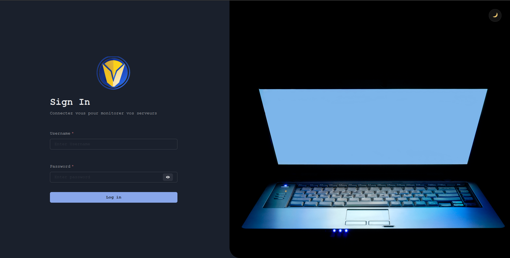

# monitor

Application de supervision de serveurs

## Installation et suppression manuelle

- Installer l'API de Monitor dans un hôte de votre choix comme le voudrait une application `Django`.
Prenez garde aux configurations (Lire le fichier `monitor_api/README.md`)
- Installer le front de Monitor dans un hôte de votre choix comme le voudrait une application `React`.
Prenez garde aux configurations comme la spécification des informations de communication entre le front et le back.

Leur suppression se passe de la même manière que des applications `Django` et `React`.

## Installation et suppression avec docker

### Installation

```sh

# deplacement dans le repertoire du front-end
cd monitor-frontend

# construction de l'image du front-end
docker build -t monitor-frontend .

# deplacement dans le repertoire du back-end 
cd ../monitor_api

# construction de l'image du back-end
docker docker build -t monitor-backend .

# deplacement dans le repertoire globale
cd ..

# lancement des containers
docker compose up [-d]

```

Un compte administrateur par défaut est crée (changeable):

- `username` : admin
- `password` : Admin123

### Suppression

```sh

# supréssion des containers
docker compose down -v

```

## Vues principales

- Login:



- Dashboard:


- Connexion au serveur:


- Services:


- Détails de l'état d'un service:


- Caractéristiques généraux d'un serveur:

